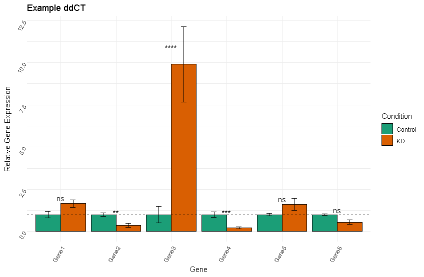
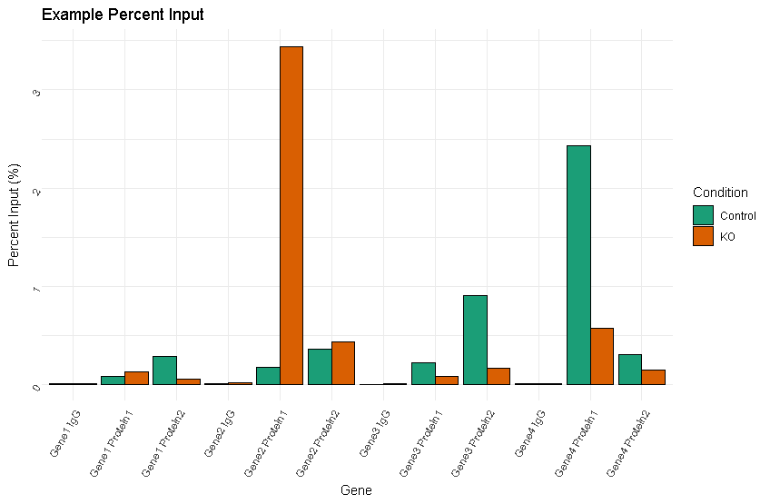

# qPCRTools
R package to help analyze qPCR data

Example Files are available to download above ("ddCT_Example.txt" and "PI_Example.txt"). These files represent example setups of qPCR data and can be run using qPCRTools. Ct values are made up and may not be representative of expected results.

Installation

```{r}
install.packages("devtools")
devtools::install_github("kevincjnixon/qPCRTools")
```
## New Shiny App User Interface
Just run:
```{r}
RTUI() #ddCT analysis
PIUI() #Percent Input Analysis
```
Select your file and input some information and generate your plots!

Usage - ddCt method

```{r}
library(qPCRTools)
easyRT() #Run interactively
easyRT(showEB=F, showStat=F) #Run interactively, but don't plot error bars (showEB=F) or stats (showStat=F)
```

When running interactively:
1. File browser will pop up, choose tab-delimited file to analyze
2. You will be prompted if this is 'bioRad' input, enter Y/N (see below for details)
3. Select a standard deviation threshold to filter Ct values (if SD of triplicates is greater than this threshold, an outlier will be selected and removed from analysis)
4. Levels of sample indicators will appear. You should use format 'Condition*delim*Replicate' in your setup. Indicate what *delim* is. Leave blank if it is a space.
5. Select your reference condition
6. Indicate how many reference genes you used (at least 1). More than 1 reference gene will use geoMean of Ct values of those genes for reference.
7. Indicate your reference gene(s)
8. Indicate how you want to average Ct values (geoMean = geometric mean or mean)
9. Enter a title for the plot
10. Choose if you want to write out results to .csv (Y/N)
  a. if Y, enter filename (ending in .csv)
    i. if file exists, overwrite? (Y/N) - 'Y' will overwrite, 'N' will offer to select new filename
  b. if N, you're done

Plot will be produced with showing conditions as colours on bars, plotting genes on x-axis and relative gene expression (delta-delta Ct method) on y-axis. Error bars are SEM (if showEB=T; default). Stats are from Benjamini-Hochberg-corrected pairwise-t-tests (if showStat=T; default).



<p class="caption">
  Delta delta CT plot
  </p>

Usage - Percent Input method
*Note that this method at the moment does not assume biological replicates, and so no stats/error bars will appear on the graph*

```{r}
library(qPCRTools)
easyPI() #Run interactively
```

When running interactively:
1. File browser will pop up, choose tab-delimited file to analyze
2. You will be prompted if this is 'bioRad' input, enter Y/N (see below for details)
3. Select a standard deviation threshold to filter Ct values (if SD of triplicates is greater than this threshold, an outlier will be selected and removed from analysis)
4. Indicate the dilution of the input for the ChIP-qPCR as a percentage. For example, a 1:10 dilution is 10%, enter 10. Another example: 1:20 dilution is 5%, enter 5.
5. Levels of sample indicators will appear. You should use the format 'Condition*delim*IP' or 'IP*delim*Condition' in your setup. Where 'Condition' is you sample condition (e.g. 'control', 'KO') and IP is the protein your 'ChIP-ing' (or input). Indicat what *delim* is. Leave blank if it is a space.
6. Indicate the order in which Condition and IP appear in your setup. Choose a number indicating where 'Condition' appears in your setup. Then choose a number indicating where 'IP' appears in your setup.
7. Indicate the reference condition (e.g. "Control")
8. Indicate which 'IP' represents the input.
9. Indicate how you want to average Ct values (geoMean = geometric mean or mean)
10. Enter a title for your plot.
11. Indicate if you want the results written to a csv file (Y/N)
  a. if 'Y' enter a filename (ending in .csv) for results to be written
12. Indicate if you want the results returned to the console (Y/N) (run as t<-easyPI() to save results as an R object 't')

A plot will be produced shoing conditions as colours on bars, plotting the genes and IPs on the x-axis and percent input on the y-axis. At the moment, no error bars or stats will be provided.


<p class="caption">
  Percent Input plot
  </p>

Setup for data input:
Tab-delimited files output from qPCR machine.

bioRad CFX machine: (Select "Y" at first prompt)

| Well | Fluor | Target | Content | Sample | Biological Set Name |  Cq  | Cq Mean | Cq Std. Dev |
|------|-------|--------|---------|--------|---------------------|------|---------|-------------|
| A01  | SYBR  | Gene   | Unkn    | WT-1   |                     | 24.37| 24.37   |      0      |

There can be more columns, but it is necessary to have the first 8 in this order. There is no header, and no blank first column.

Other format: (Select "N" at first prompt)

*Header 10 lines long*

| Position |  Flag | Sample | Detector | Task |  Ct  |
|----------|-------|--------|----------|------|------|
|    A1    | Passed| WT-1   | Gene     | Unkn | 24.37|

There can be more columns, but it is necessary to have these columns in this order with these names

Note that 'Sample' in both cases is in the format 'Condition*delimiter*replicate' (i.e. WT is the condition, '-' is the delimiter, and 1 is the replicate)

There should be technical triplicates for each gene and each condition/replicate, and at least two biological replicates per condition.


**Don't like the colour scheme?**
Google 'RColorBrewer palettes' to look for character codes of various colour schemes. Default is 'Dark2'.  Change colour using the 'col' option:

```{r}
easyRT(col="Spectral")
easyPI(col="Set2")
```

**More Functions to come later (dilution series)**
